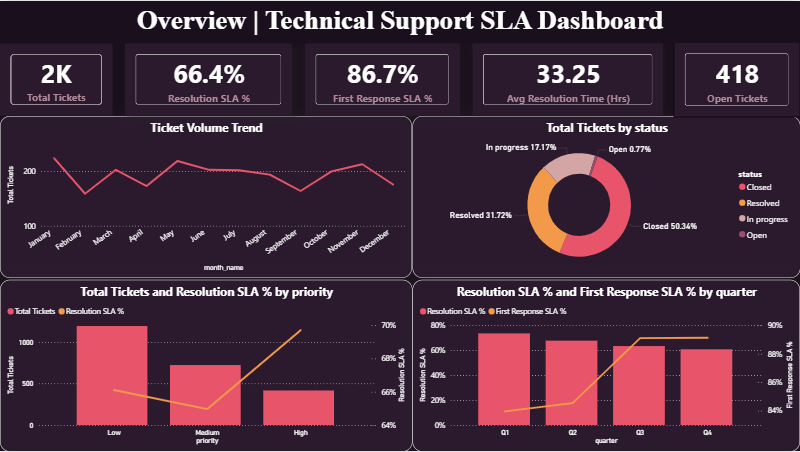
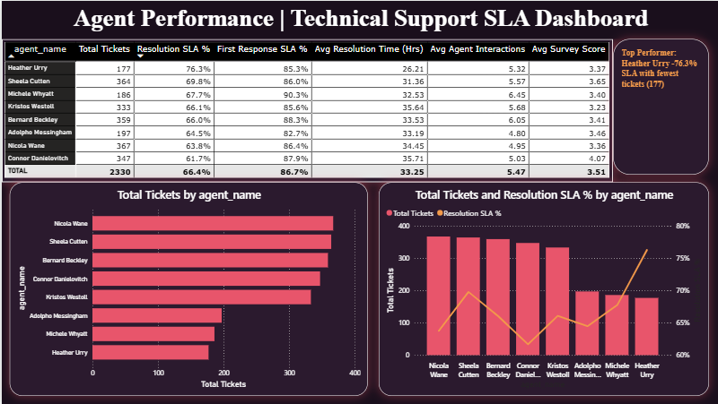
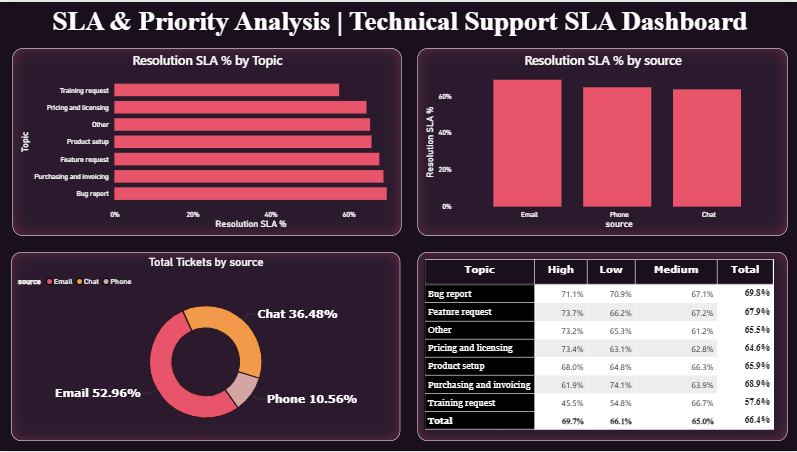
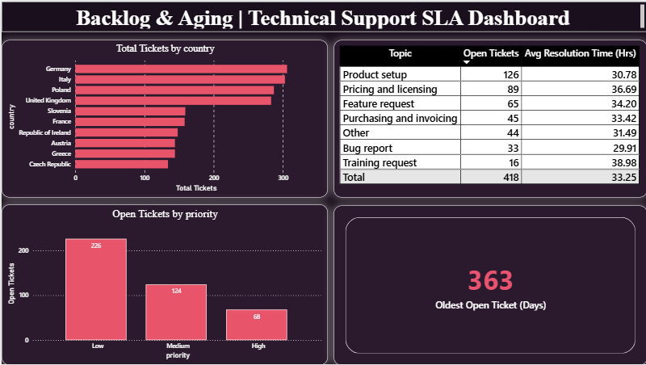

# Technical Support SLA Analytics

A Power BI dashboard analyzing technical support ticket performance, built on a PostgreSQL star schema. Tracks SLA compliance, agent performance, and ticket backlog across a 4-page interactive report.

**Dataset:** [Technical Support Dataset](https://www.kaggle.com/) (Kaggle) — 2,330 tickets
**Tools:** PostgreSQL, Power BI (Power Query, DAX), SQL

## Data Model
Star schema in PostgreSQL: **Fact_Tickets** + 7 dimension tables (Agent, Date, Priority, Topic, Source, Status, Country).

## Dashboard Pages
1. **Overview** — Key KPIs, ticket trend, status breakdown, SLA by priority/quarter
2. **Agent Performance** — Agent scorecard; Heather Urry leads with 76.3% Resolution SLA despite the lowest ticket volume
3. **SLA & Priority Analysis** — SLA by topic/source/priority; High-priority Training requests lag at 45.5% SLA
4. **Backlog & Aging** — Open ticket backlog by country/topic/priority; oldest open ticket at 363 days

## Key Insights
- Overall Resolution SLA: **66.4%** vs First Response SLA: **86.7%** — response is fast, resolution lags
- **Heather Urry** outperforms on SLA with the fewest tickets — a potential best-practice case
- **High-priority Training requests** are the weakest SLA segment, worth root-cause review
- Backlog includes tickets open **363+ days**, signaling a need for escalation policies

## Preview

**Overview**

**Agent Performance**

**SLA & Priority Analysis**

**Backlog & Aging**

## Repository Structure
├── PowerBI/ # .pbix file + PDF export
├── SQL/ # Schema setup and analysis queries
└── Screenshorts/ # Dashboard screenshots
